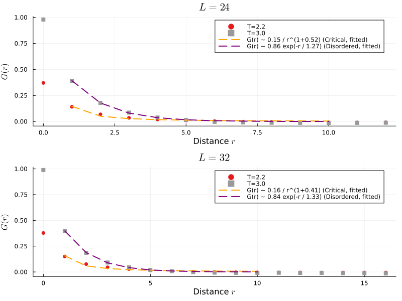
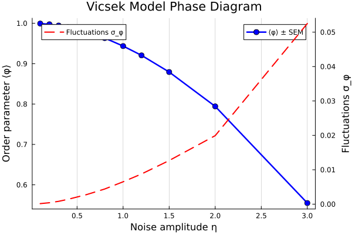
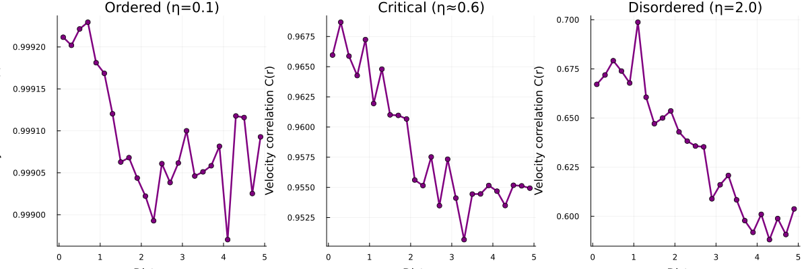
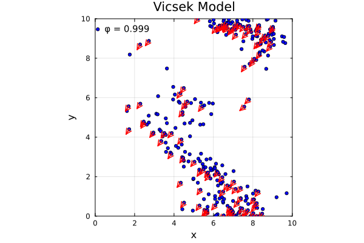
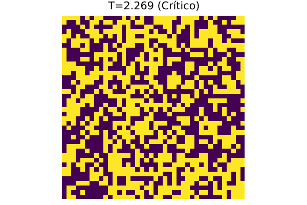
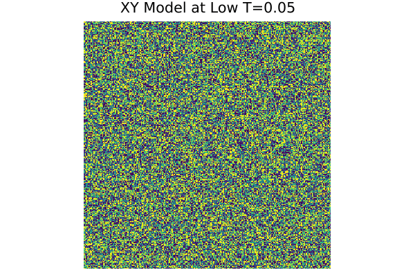
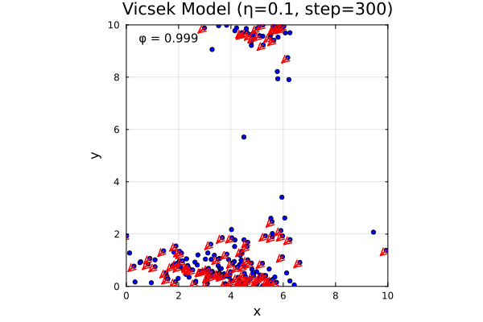

# Statistical Physics — Computational Models in Julia

Classical models of **statistical physics and complex systems** implemented in
[Julia](https://julialang.org): equilibrium phase transitions, out-of-equilibrium
collective motion, synchronization, and stochastic processes — with Monte Carlo,
ensemble averaging, and finite-size critical analysis.

> Developed for the graduate course *Física Estadística Computacional* (MSc in Physics).
> Author: **José Ake** · [github.com/ak3sit0](https://github.com/ak3sit0)

---

## Models

| Module | Model | Method | Key result |
|--------|-------|--------|-----------|
| [`spin-models/ising`](spin-models/ising) | 2D Ising | Metropolis and Wolff Monte Carlo, Binder cumulant | Ferro–para transition; recovers Onsager's exact `Tc = 2/ln(1+√2) ≈ 2.269` |
| [`spin-models/xy`](spin-models/xy) | 2D XY | Metropolis, vortex detection | Kosterlitz–Thouless transition |
| [`vicsek`](vicsek) | Vicsek | Self-propulsion, threaded ensembles | Order–disorder transition (out of equilibrium), `φ(η)` |
| [`kuramoto`](kuramoto) | Kuramoto | Coupled phase oscillators | Spontaneous synchronization, order parameter `r(K)` |
| [`random-walks`](random-walks) | Brownian, Ornstein–Uhlenbeck, Run-and-Tumble, resetting | Langevin dynamics, MSD | Diffusion, persistence, stochastic resetting |

## Highlighted Results

### Ising Model: Critical Temperature via Binder Cumulant

The 2D Ising critical point is found via the **Binder cumulant** crossing across lattice
sizes (finite-size scaling), recovering the exact Onsager value `Tc = 2/ln(1+√2) ≈ 2.2692`.



Also computed: magnetization, specific heat, and spatial correlations.

### Vicsek Model: Order-Disorder Phase Transition

Self-propelled particles exhibit a sharp phase transition from ordered (aligned flocking)
to disordered (random motion) as noise increases.

| Low Noise (Ordered) | High Noise (Disordered) | Order Parameter φ(η) |
|:---:|:---:|:---:|
|  |  |  |

## Gallery

| Ising at `Tc` | XY (low T) | Vicsek (ordered) |
|:---:|:---:|:---:|
|  |  |  |

## Engineering

- **`vicsek/SimulationUtils.jl`** — a reusable module: metaprogramming (`@pbc`, a zero-overhead
  `@debug`, `@timed`) and a higher-order `parallel_ensemble` that runs realizations across
  threads with an independent RNG per thread, keeping results reproducible.
- Observables are estimated by averaging over independent realizations with reported SEM.

## Reproducibility

Requires **Julia 1.9+**. Dependencies are pinned in `Project.toml`:

```julia
using Pkg
Pkg.activate(".")
Pkg.instantiate()
```

Notebooks run with `IJulia` (or VS Code + the Julia extension). For threading:
`export JULIA_NUM_THREADS=8`.

## Usage

### Using modules directly

Each model is available as a reusable Julia module in `src/`:

```julia
using Pkg
Pkg.activate(".")

# Load a model
using Ising

# Create and simulate
model = Ising.IsingModel(L=20, T=2.269)
Ising.equilibrate!(model, 1000)
M = Ising.compute_magnetization(model)
```

Available modules: `Ising`, `XY`, `Vicsek`, `Kuramoto`, `RandomWalks`, `SimulationUtils`.

### Running tests

Physics-based tests validate key properties (e.g., Onsager critical temperature, MSD exponents):

```bash
julia --project -e 'using Pkg; Pkg.test()'
```

Tests run automatically on every push via GitHub Actions (see `.github/workflows/test.yml`).

## Structure

```
statistical-physics-computational/
├── spin-models/      ising/ · xy/
├── vicsek/           vicsek.ipynb · SimulationUtils.jl
├── kuramoto/         kuramoto.ipynb
├── random-walks/     brownian, ou, run-and-tumble, resetting notebooks
├── assets/           GIFs and animations
└── Project.toml      reproducible environment
```

## References

Onsager (1944), *Crystal Statistics I*; Landau & Binder, *A Guide to Monte Carlo Simulations
in Statistical Physics*; Vicsek et al. (1995); Kuramoto (1975). Per-model references live in
each module's README.

## License

Code under the [MIT](LICENSE) license. © 2026 José Ake.
